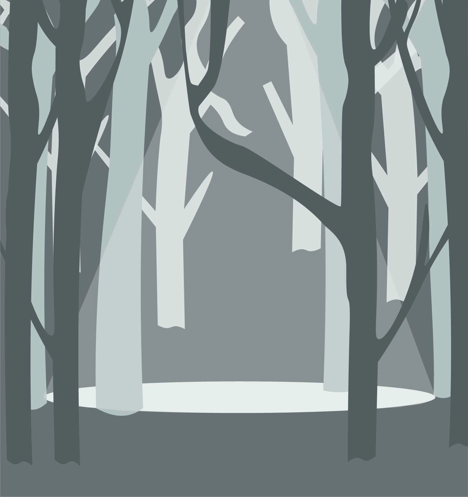
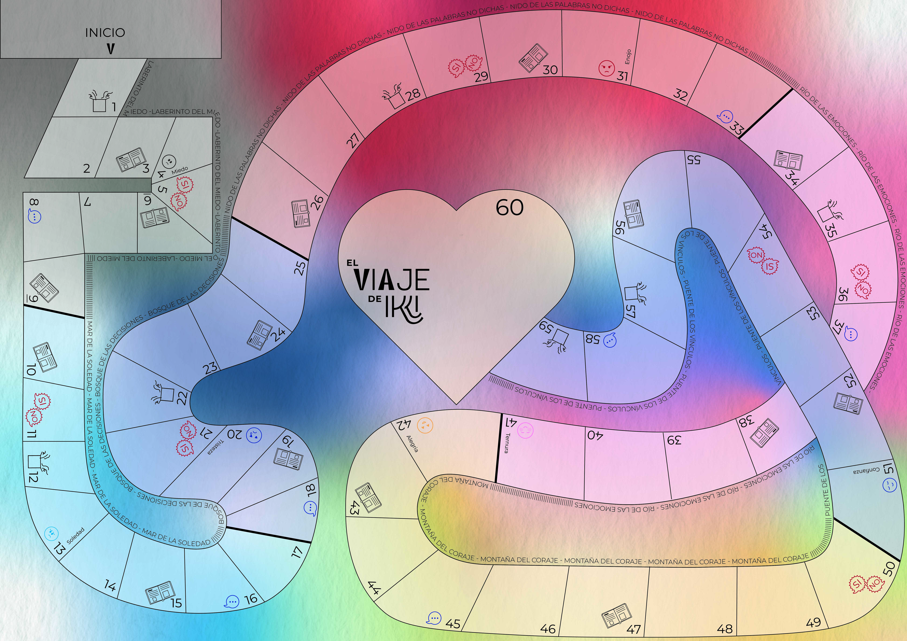

# EL VIAJE DE IKKI: Cuentos, Juegos y Emociones para Cuidar la Infancia

**\#XperienciaUNR 2025 | UNR LET - Ciencias**

## 🌟 Introducción al Proyecto

**El Viaje de Ikki** es una propuesta lúdica y pedagógica diseñada para acompañar a niños y adolescentes en el reconocimiento de sus emociones, derechos y vínculos. Funciona como un recurso de **experiencia mixta** que complementa un juego de tablero físico con una aplicación web interactiva que utiliza **Realidad Aumentada (AR)**.

El objetivo principal es generar espacios seguros de diálogo al ofrecer herramientas para abordar temas sensibles a través de **cuentos-acertijos innovadores**, debates y reflexiones sobre los derechos del niño.

### Equipo de Desarrollo

| Rol | Integrante |
| :--- | :--- |
| **Directora** | Lorena Maruf |
| **Co-director** | Lisandro Duri|
| **Desarrollador** | Pedro Casado |
| **Diseñadora** | Sofia Bueno  |

---

## 🕹 Flujo del Juego y Mecánica AR

El juego se basa en un recorrido por casilleros de **Emoción, Debate, Diálogo, Cuento y Regalo**, donde el casillero **Cuento** es el punto central de la innovación:

1.  **Activación AR:** Al caer en el casillero "Cuento", la aplicación activa la cámara y el entorno AR.
2.  **Decisión Inmersiva:** El equipo escanea un **marcador físico** que proyecta las opciones de respuesta (A/B/C) en 3D.
3.  **Refuerzo Visual:** Si el equipo acierta la respuesta, la aplicación activa la **animación 3D de Ikki** como refuerzo positivo y visual, consolidando la reflexión del tema abordado. Si es incorrecta, retrocede 2 casilleros.

---

## 🚀 ¡Prueba el Viaje de Ikki!

Puedes probar la experiencia de la aplicación web desplegada en Netlify.

**Instrucciones:**
1.  Abre la cámara de tu celular o tablet.
2.  Escanea el código QR de la imagen inferior para acceder directamente al juego.

> **¡IMPORTANTE!** Para probar la funcionalidad completa de Realidad Aumentada, es necesario contar con un **marcador físico** que sirva como objetivo de escaneo. Para el testeo de esta demo, puedes escanear la foto que se adjunta abajo.

### Código QR de la Demo (Netlify)

### Imágen marcador para escanear durante el cuento

  

### Tablero del juego

  

